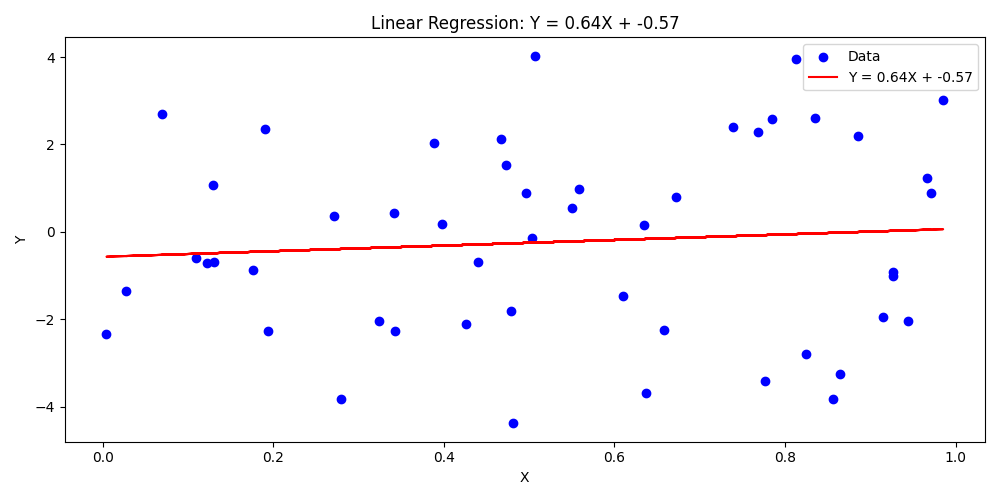
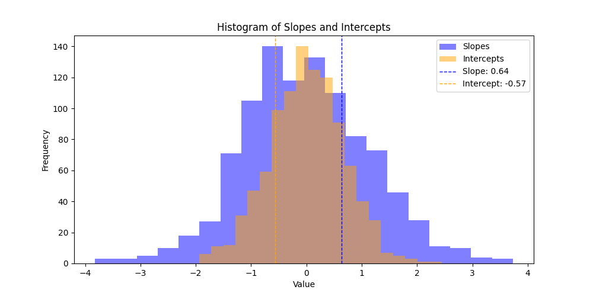

# Assignment 6: Linear Regression Simulation

[Demo Video Link](https://youtu.be/brY_SF3q7dM)

## Project Overview
This project explores how random data can influence linear regression results, particularly when there is no actual relationship between variables. The simulation allows users to experiment with different parameters and observe their effects on regression estimates.

## Key Observations

### Effect of Sample Size (N)
- Large N (e.g., N=500): Results in more stable estimates with slopes concentrated around zero
- Small N (e.g., N=10): Shows more extreme slopes and greater variability
- The histograms become more bell-shaped and narrower as sample size increases

### Impact of Variance (σ²)
- Low variance (σ²=1): Data points cluster more tightly, leading to more consistent estimates
- High variance (σ²=5): Creates more scattered plots and wider histogram distributions
- Higher variance tends to mask any apparent patterns in the data

### Interesting Parameter Combinations

1. **Baseline Case**
   - N = 50, μ = 0, σ² = 1, S = 1000
   - Shows typical random variation in regression estimates

2. **High Variance Example**
   - N = 50, μ = 0, σ² = 5, S = 1000
   - Demonstrates how noise can lead to less reliable estimates

3. **Large Sample Effect**
   - N = 500, μ = 0, σ² = 1, S = 1000
   - Shows how larger samples provide more stable results

## Generated Plots
Here are example plots generated with the following parameters:
- N = 50
- μ = 10
- σ² = 1
- S = 1000

### Scatter Plot with Regression Line

  

### Histogram of Slopes and Intercepts

  

## Key Insights
- Sample size and variance both significantly affect the reliability of regression estimates
- Even with no true relationship, random chance can create apparent patterns
- Larger samples don't necessarily overcome the challenges of high variance
- The importance of considering both sample size and variance when interpreting regression results